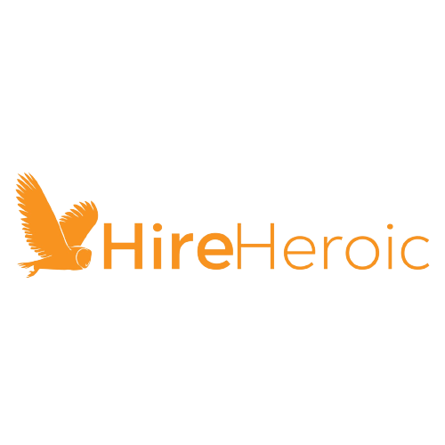
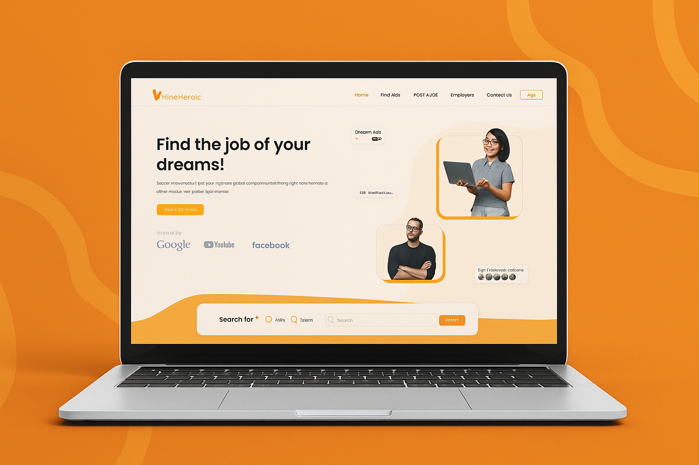

# 💼 HireHeroic – Full-Stack Job Aggregator Platform

**HireHeroic** is a professional-grade job aggregator web application developed as a Fiverr project. I was responsible for **the entire product lifecycle** — from UI/UX design to full backend development — delivering a scalable and visually appealing platform for real-time job discovery.

---

## 🔧 About the Project

This platform was commissioned by a Fiverr client who needed a fully functional job board with real-time data and user-centric design. I designed and built both the front-end and back-end, ensuring fast performance, responsive design, and a smooth user experience.

Job listings are sourced via **integrated third-party job APIs**, giving users access to thousands of up-to-date listings from multiple providers. The application also supports job search filters, saved listings, and an intuitive tracking system for applicants.

---

## 💡 Key Technologies

- **HTML + Tailwind CSS** – Clean, responsive, and modern UI
- **JavaScript** – Dynamic interactivity and behavior
- **PHP** – Backend services and API integration
- **MySQL** – Data storage and query management
- **External APIs** – For aggregating job listings across platforms

---

## 🎯 What This Project Showcases

- Full **UI/UX design** tailored to the job-seeking experience
- **RESTful API integration** with third-party job data providers
- **Custom backend** for handling job storage, user favorites, and search logic
- **Scalable code architecture** with performance in mind
- Professional delivery under Fiverr contract and timeline

---

## 📸 Platform in Action

Here's a glimpse of the platform, showcasing its clean UI and powerful features.

.png)
.png)
.png)
.png)
.png)

---
📌 **This project is part of my professional portfolio**. It demonstrates my ability to execute a real-world, client-facing application from scratch, both aesthetically and functionally.

If you're interested in hiring me to build a similar solution or want to discuss your idea — feel free to connect!

---

Made with ❤️ by Ilija Dončič.
